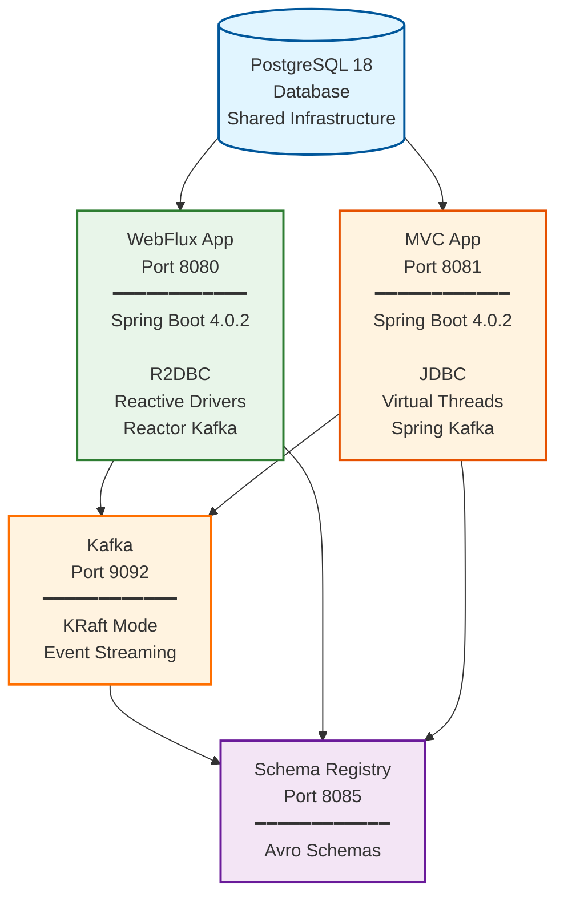
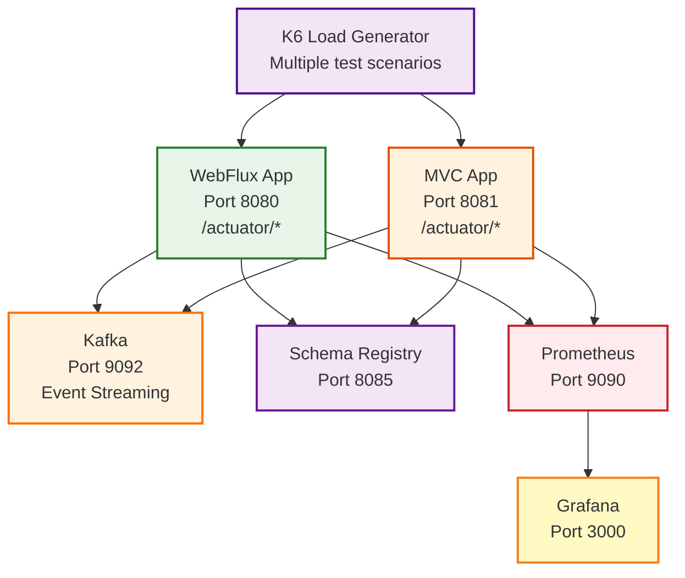

# Spring Boot Performance Comparison: WebFlux vs MVC with Virtual Threads

> **[Read the full blog post](documentation/BLOG.md)** — A detailed write-up of the experiment, results, and conclusions.

## Hypothesis

**Spring MVC running on Virtual Threads will be at least as well performing as Spring WebFlux.**

## Background

### The Traditional Concurrency Challenge

Traditionally, Spring MVC applications use a thread-per-request model with platform threads. This approach has limitations:

- **Platform threads are expensive**: Each thread consumes ~1-2MB of memory
- **Thread pool exhaustion**: Limited to thousands of concurrent requests
- **Context switching overhead**: OS-level thread scheduling adds latency
- **Blocking I/O bottlenecks**: Threads wait idle during database/network calls

### The Reactive Solution: Spring WebFlux

Spring WebFlux was introduced to address these limitations using:

- **Non-blocking I/O**: Asynchronous processing with Reactor framework
- **Event loop model**: Small number of threads handling many concurrent requests
- **Backpressure support**: Flow control for data streams
- **Functional programming style**: Mono/Flux reactive types

**Trade-offs:**
- ✅ Excellent scalability for I/O-bound workloads
- ✅ Efficient resource utilization
- ❌ Steep learning curve
- ❌ Complex debugging and stack traces
- ❌ Requires reactive drivers (R2DBC vs JDBC)
- ❌ Limited ecosystem compatibility
- ❌ Difficult error handling and composition

### The Game Changer: Virtual Threads (Project Loom)

Java 21+ introduces Virtual Threads, fundamentally changing the concurrency landscape:

- **Lightweight**: Virtual threads use ~1KB of memory (1000x less than platform threads)
- **Massive scalability**: Millions of virtual threads on a single JVM
- **Familiar programming model**: Standard blocking code works efficiently
- **JVM-managed**: Smart scheduling without OS context switching
- **Backward compatible**: Existing JDBC drivers and blocking APIs work seamlessly

**Spring Boot 3.2+ Integration:**
```yaml
spring:
  threads:
    virtual:
      enabled: true
```

This single configuration transforms Spring MVC to use virtual threads for request handling.

## Rationale for the Hypothesis

### Why Virtual Threads May Match or Exceed WebFlux Performance

1. **Eliminates the main WebFlux advantage**: Virtual threads remove the scalability limitation of platform threads while maintaining simple blocking code

2. **Simpler code paths**: No reactive wrapping/unwrapping overhead, scheduler complexity, or context switching between reactive operators

3. **Better CPU cache utilization**: Sequential blocking code may have better locality than event-driven code

4. **Reduced memory allocation**: No need for reactive type objects (Mono/Flux) and their operator chains

5. **Optimized JVM scheduling**: Virtual threads are scheduled by the JVM, which has better context about application behavior than OS schedulers

6. **Mature ecosystem**: Full JDBC driver optimizations vs newer R2DBC drivers

7. **Reduced complexity overhead**: WebFlux requires coordination across reactive streams, operators, and schedulers

### When WebFlux Might Still Win

- **Backpressure scenarios**: Built-in flow control for data streams
- **Stream processing**: True reactive streams with complex transformations
- **Pure non-blocking stack**: When using non-blocking libraries end-to-end
- **Memory-constrained environments**: Event loop model may use less total memory

## Test Implementation

### Architecture Overview



### Application Specifications

#### Reactive WebFlux Application
- **Framework**: Spring Boot 4.0.2
- **Web Stack**: Spring WebFlux (Netty)
- **Database**: Spring Data R2DBC
- **Driver**: R2DBC PostgreSQL
- **Concurrency Model**: Event loop with reactive streams
- **Language**: Kotlin 2.2
- **Java**: 24

#### Non-Reactive MVC Application
- **Framework**: Spring Boot 4.0.2
- **Web Stack**: Spring MVC (Tomcat)
- **Database**: Spring Data JDBC
- **Driver**: PostgreSQL JDBC
- **Concurrency Model**: Virtual threads
- **Language**: Kotlin 2.2
- **Java**: 24
- **Configuration**: `spring.threads.virtual.enabled=true`

### Test Scenarios

Performance tests will measure:

1. **Throughput**: Requests per second under sustained load
2. **Latency**: P50, P95, P99 response times
3. **Resource Utilization**: CPU, memory, thread count
4. **Database Load**: Connection pool usage, query performance
5. **Scalability**: Performance degradation under increasing load

#### Workload Patterns

**1. Simple CRUD Operations**
- Single database read
- Single database write
- Read-modify-write transaction

**2. I/O-Intensive Operations**
- Multiple sequential database queries
- Parallel database queries
- Database + external API calls

**3. Mixed Workloads**
- 70% reads, 30% writes
- Variable response times
- Realistic production patterns

**4. Stress Tests**
- Gradual load increase (0-10K RPS)
- Sustained high load
- Spike/burst patterns

## Success Criteria

### Hypothesis Confirmation
The hypothesis is **confirmed** if Spring MVC with Virtual Threads:
- Achieves ≥95% of WebFlux throughput across all scenarios
- Maintains comparable or better P95 latency
- Uses similar or fewer system resources

### Additional Metrics
- **Developer Experience**: Code complexity, maintainability
- **Debugging**: Stack trace clarity, error handling
- **Testing**: Test complexity and reliability
- **Operational**: Monitoring, troubleshooting ease

## Expected Outcomes

### Likely Results

**Virtual Threads advantages:**
- ✅ Simpler code, easier to maintain
- ✅ Better debuggability
- ✅ Familiar programming model
- ✅ Broader ecosystem support
- ✅ Comparable or better performance for typical CRUD operations

**WebFlux advantages:**
- ✅ Built-in backpressure
- ✅ Better for true streaming scenarios
- ✅ More control over threading model
- ✅ Potentially better memory efficiency at extreme scale

### Industry Context

This comparison aligns with broader industry observations:

- **Project Loom's Promise**: Virtual threads were designed to make reactive programming unnecessary for most use cases
- **Spring Team's Position**: Spring Boot 3.2+ added first-class virtual thread support, acknowledging their importance
- **Community Feedback**: Many teams report moving back from reactive to imperative code with virtual threads
- **Maturity**: JDBC drivers are more optimized than R2DBC after decades of development

## Technical Details

### Project Structure

```
spring-boot-performance-2026/
├── reactive-webflux/           # Spring WebFlux application
│   ├── src/
│   ├── build.gradle.kts
│   ├── Dockerfile
│   └── docker-compose.yml
├── non-reactive-mvc/           # Spring MVC application
│   ├── src/
│   ├── build.gradle.kts
│   ├── Dockerfile
│   └── docker-compose.yml
├── docker-compose.yml          # Shared infrastructure only
└── README.md                   # This file
```

### E-Commerce Domain Implementation

Both applications implement identical REST APIs for an e-commerce domain:

**Domain Entities:**
- **Customer**: id, name, email, address, createdAt
- **Order**: id, customerId, orderDate, totalAmount, status
- **OrderItem**: id, orderId, productName, quantity, price

**REST Endpoints:**

Customers:
- `GET /api/customers` - List all customers
- `GET /api/customers/{id}` - Get customer by ID
- `POST /api/customers` - Create new customer
- `DELETE /api/customers/{id}` - Delete customer

Orders:
- `GET /api/orders/{id}` - Get order with customer and items
- `GET /api/customers/{customerId}/orders` - List customer's orders
- `POST /api/orders` - Create order with items
- `DELETE /api/orders/{id}` - Delete order (cascades to items)

Order Items:
- `GET /api/orders/{orderId}/items` - List order items
- `POST /api/orders/{orderId}/items` - Add item to order
- `DELETE /api/order-items/{id}` - Delete order item

**Database Schema:**
- PostgreSQL 18 with UUID primary keys
- Foreign key constraints with cascade delete
- Check constraints for amounts and quantities
- Indexes on common query fields
- Sample data: 100 customers, 500 orders, ~1500 order items

### Event-Driven Architecture with Kafka

Both applications implement event publishing using Apache Kafka and Confluent Schema Registry with Avro serialization.

**Infrastructure:**
- **Apache Kafka 7.6.0**: Running in KRaft mode (no ZooKeeper dependency)
- **Confluent Schema Registry 7.6.0**: Manages Avro schemas with backward compatibility
- **Avro Serialization**: Binary serialization with schema evolution support

**Event Topics (9 total):**

Each entity operation publishes an event to a dedicated topic:

| Entity | Created | Updated | Deleted |
|--------|---------|---------|---------|
| **Customer** | `customer.created` | `customer.updated` | `customer.deleted` |
| **Order** | `order.created` | `order.updated` | `order.deleted` |
| **Order Item** | `order-item.created` | `order-item.updated` | `order-item.deleted` |

**Event Payload Structure:**

All events follow a consistent structure with full entity data:

```json
{
  "eventId": "uuid",
  "eventType": "CUSTOMER_CREATED",
  "timestamp": 1738342800000,
  "customerId": "uuid",
  "customerName": "...",
  "customerEmail": "...",
  "customerAddress": "...",
  "createdAt": 1738342800000,
  "metadata": {
    "source": "reactive-webflux",
    "version": "1.0"
  }
}
```

**Benefits of Full Entity Events:**
- Consumers don't need database queries
- Better for event sourcing patterns
- Realistic production scenario
- Easier debugging and auditing

**Delivery Semantics:**

**Best-effort delivery** with graceful degradation:
- Database transaction completes first
- Kafka message sent asynchronously after DB commit
- Failures logged but don't break the request (no rollback)
- WebFlux: Uses `Mono.onErrorResume()` for reactive error handling
- MVC: Uses try-catch with error logging

This approach:
- ✅ Simplifies implementation
- ✅ Measures baseline Kafka overhead for performance testing
- ✅ Ensures requests always succeed even if Kafka is down
- ❌ No transactional guarantee between DB and Kafka
- ❌ Possible missed events if Kafka is unavailable

**Schema Evolution:**

Avro schemas support backward compatibility:
- Each event type has its own subject in Schema Registry
- New fields can be added without breaking consumers
- Schema Registry validates compatibility automatically
- Schemas are cached by producers for performance

**Implementation Differences:**

**WebFlux Approach:**
- Uses `reactor-kafka` with `KafkaSender`
- Reactive `SenderRecord` for non-blocking publishing
- Event publishing via `.flatMap()` after DB save
- Error handling with `.onErrorResume()`

**MVC Approach:**
- Uses `spring-kafka` with `KafkaTemplate`
- Synchronous `send()` with async callback
- Event publishing after DB transaction completes
- Error handling with try-catch blocks

**Configuration:**

Both applications configure Kafka producers identically:
- **Bootstrap servers**: kafka:9092 (Docker internal network)
- **Schema Registry**: http://schema-registry:8081
- **Key serializer**: StringSerializer
- **Value serializer**: KafkaAvroSerializer
- **Acks**: 1 (leader acknowledgment)
- **Retries**: 3
- **Max in-flight requests**: 5

**Monitoring:**

Grafana dashboards include Kafka-specific panels:
- Kafka Messages Sent Rate (by topic)
- Kafka Send Latency P95
- Kafka Producer Errors

**Performance Impact:**

Expected overhead per write operation:
- Avro serialization: ~1-5ms
- Network round trip to Kafka: ~5-10ms (local Docker)
- Schema Registry cache lookup: ~1ms (cached)
- **Total additional latency**: ~10-20ms

This overhead is measured during load tests to compare WebFlux vs MVC event publishing performance.

**Testing Event Publishing:**

Verify events are being published:

```bash
# Check topics
docker exec spring-boot-performance-2026-kafka \
  kafka-topics --bootstrap-server localhost:9092 --list

# Check schemas
curl http://localhost:8085/subjects | jq .

# Consume events (binary Avro output)
docker exec spring-boot-performance-2026-kafka \
  kafka-console-consumer \
  --bootstrap-server localhost:9092 \
  --topic customer.created \
  --from-beginning
```

**REST Endpoints with Event Publishing:**

All write operations now publish events:

Customers:
- `POST /api/customers` → `customer.created` event
- `PUT /api/customers/{id}` → `customer.updated` event
- `DELETE /api/customers/{id}` → `customer.deleted` event

Orders:
- `POST /api/orders` → `order.created` event
- `PUT /api/orders/{id}` → `order.updated` event
- `DELETE /api/orders/{id}` → `order.deleted` event

Order Items:
- `POST /api/orders/{orderId}/items` → `order-item.created` event
- `PUT /api/order-items/{id}` → `order-item.updated` event
- `DELETE /api/order-items/{id}` → `order-item.deleted` event

### Running the Applications

**Start Infrastructure:**
```bash
docker-compose up -d postgres
```

**Reactive WebFlux (Port 8080):**
```bash
cd reactive-webflux
./gradlew bootRun
```

Test endpoint:
```bash
curl http://localhost:8080/api/customers | jq '. | length'
```

**Non-Reactive MVC (Port 8081):**
```bash
cd non-reactive-mvc
./gradlew bootRun
```

Test endpoint:
```bash
curl http://localhost:8081/api/customers | jq '. | length'
```

**Running Both Apps Simultaneously:**

Both applications can run concurrently on different ports (8080 and 8081), connecting to the same PostgreSQL database. This allows for side-by-side comparison and testing.

### Technology Stack

- **Spring Boot**: 4.0.2
- **Kotlin**: 2.2.0
- **Java**: 24
- **Gradle**: 9.2
- **PostgreSQL**: 18
- **Apache Kafka**: 7.6.0 (Confluent Platform, KRaft mode)
- **Schema Registry**: 7.6.0 (Confluent)
- **Apache Avro**: 1.11.3
- **HashiCorp Vault**: latest
- **Docker**: For containerization
- **Testcontainers**: For integration testing

## Performance Testing and Monitoring

### Architecture Overview

The project includes comprehensive performance testing and observability infrastructure:



### Monitoring Stack

#### Spring Boot Actuator
Both applications expose metrics via Spring Boot Actuator:

**Endpoints:**
- `http://localhost:8080/actuator/health` - WebFlux health status
- `http://localhost:8081/actuator/health` - MVC health status
- `http://localhost:8080/actuator/prometheus` - WebFlux metrics
- `http://localhost:8081/actuator/prometheus` - MVC metrics

**Available Metrics:**
- JVM memory usage (heap and non-heap)
- Thread counts (including virtual threads)
- CPU usage (process and system)
- HTTP request metrics (count, latency percentiles)
- Database connection pool metrics (R2DBC for WebFlux, HikariCP for MVC)
- Garbage collection metrics

#### Prometheus
Prometheus scrapes metrics from both applications every 5 seconds.

**Access:** http://localhost:9090

**Sample Queries:**
```promql
# Request rate comparison
rate(http_server_requests_seconds_count[1m])

# P95 latency
http_server_requests_seconds{quantile="0.95"}

# Thread count comparison
jvm_threads_live{application=~"reactive-webflux|non-reactive-mvc"}
```

#### Grafana
Pre-configured dashboards for performance analysis.

**Access:** http://localhost:3000 (admin/admin)

**Available Dashboards:**
- **Spring WebFlux Performance** (http://localhost:3000/d/webflux-perf) - Metrics for reactive-webflux application only
- **Spring MVC Performance (Virtual Threads)** (http://localhost:3000/d/mvc-perf) - Metrics for non-reactive-mvc application only

**Dashboard Layout:**

Each dashboard is organized with summary stat panels at the top for at-a-glance metrics, followed by detailed timeseries graphs. Both dashboards have identical layouts, showing metrics for their respective application.

**Row 1-2: Summary Stat Panels**
- **P95 Response Time** - 95th percentile latency with color-coded thresholds (green < 500ms, yellow < 1s, red ≥ 1s)
- **Avg Thread Count** - Mean thread count over selected time window (WebFlux: ~10-50 threads, MVC: higher due to virtual threads)
- **Avg Memory Usage** - Mean heap memory consumption with percentage-based thresholds
- **Avg CPU Usage** - Mean CPU utilization (green < 50%, yellow < 80%, red ≥ 80%)
- **Avg Request Rate** - Mean requests per second
- **Avg Error Rate** - Percentage of 5xx errors (green < 1%, yellow < 5%, red ≥ 5%)
- **Avg Response Time (Mean)** - Mean response time (not just P95)
- **Application Uptime** - Current uptime in hours
- **Avg GC Pause Time** - Mean garbage collection pause duration
- **DB Connection Pool** - Mean active database connections (R2DBC for WebFlux, HikariCP for MVC)

**Rows 3-8: Timeseries Graphs** (Detailed over time)
- **Request Rate** - Line chart showing req/s trends
- **Response Time (Avg & Max)** - Line chart comparing average and maximum response times
- **JVM Heap Memory Usage** - Line chart showing heap memory over time
- **CPU Usage** - Line chart comparing process and system CPU usage
- **Thread Count** - Line chart showing thread count trends
- **Kafka Messages Sent Rate** - Line chart showing Kafka messages per second by topic
- **Kafka Send Latency P95** - Line chart showing 95th percentile Kafka send latency
- **Kafka Producer Errors** - Line chart showing Kafka producer error rate

**Features:**
- All stat panels use 5-minute rolling averages for consistent comparison
- Color-coded thresholds provide immediate visual feedback on performance (green/yellow/red)
- Sparklines in stat panels show trend direction
- True P95 calculation using histogram buckets (pre-configured in both applications)
- URI filter variable allows filtering by specific API endpoints (/api/customers, /api/orders, etc.)
- Real-time updates during load tests (Prometheus scrapes every 5 seconds)
- Tests are run sequentially (not simultaneously), so use separate dashboards for clearer analysis

**Configuration:**
Both applications are pre-configured with histogram metrics for accurate percentile calculations:
```yaml
management:
  metrics:
    distribution:
      percentiles-histogram:
        http.server.requests: true
```

This enables the `http_server_requests_seconds_bucket` metric required for calculating true P95/P99 values using PromQL's `histogram_quantile()` function.

### Load Testing with K6

#### Test Scenarios

**1. Baseline Test** (`k6/scripts/baseline.js`)
- Gradual ramp-up: 0 → 50 (30s) → 50 (2m) → 100 (30s) → 100 (2m) → 0 (30s)
- Total duration: 5 minutes 30 seconds
- Target: `/api/customers` endpoint
- Thresholds: P95 < 500ms, P99 < 1000ms, error rate < 1%

**2. Read-Heavy Workload** (`k6/scripts/read-heavy.js`)
- 80% reads, 20% writes
- 100 concurrent users
- Duration: 5 minutes
- Tests customer and order endpoints

**3. Stress Test** (`k6/scripts/stress-test.js`)
- Gradual load increase: 100 → 200 → 500 → 1000 users
- Duration: 30 minutes
- More lenient thresholds to find breaking point

**4. Spike Test** (`k6/scripts/spike-test.js`)
- Sudden traffic spikes: 50 → 500 → 50 → 1000 users
- Tests application resilience
- Simulates real-world traffic bursts

#### Running Load Tests

**No Installation Required** - Tests run using K6 Docker image

**Quick Single Test:**
```bash
cd k6

# Test WebFlux with baseline scenario
./run-single-test.sh webflux baseline

# Test MVC with baseline scenario
./run-single-test.sh mvc baseline

# Run other scenarios
./run-single-test.sh webflux read-heavy
./run-single-test.sh mvc stress-test
```

**Full Test Suite:**
```bash
cd k6
./run-tests-docker.sh
```

This script runs all scenarios against both applications sequentially with 30-second cooldown periods between tests. Results are saved to `k6/results/` as JSON files.

**Viewing Results:**

While tests are running:
- **Grafana Dashboards**:
  - WebFlux: http://localhost:3000/d/webflux-perf
  - MVC: http://localhost:3000/d/mvc-perf
  - Watch real-time metrics update
  - Stat panels show 5-minute rolling averages
  - Use URI filter to focus on specific endpoints
- **Console Output**: K6 displays live progress and summary statistics
- **Prometheus**: http://localhost:9090 (query raw metrics)

After tests complete:
- **K6 Summary**: Console displays final metrics (requests/sec, response times, error rates)
- **JSON Results**: Detailed results saved in `k6/results/` directory (when using `run-tests-docker.sh`)
- **Grafana History**: Time-series graphs show performance over the test duration

### Running the Complete Stack

**Start all services:**
```bash
docker-compose up -d
```

This starts:
- PostgreSQL (port 5432)
- Kafka (port 9092)
- Schema Registry (port 8085)
- Vault (port 8200)
- Prometheus (port 9090)
- Grafana (port 3000)
- WebFlux application (port 8080)
- MVC application (port 8081)

**Verify services:**
```bash
# Check all services are running
docker-compose ps

# Check Prometheus targets
curl http://localhost:9090/api/v1/targets

# Check Actuator endpoints
curl http://localhost:8080/actuator/health
curl http://localhost:8081/actuator/health
```

**Access UIs:**
- Grafana: http://localhost:3000 (admin/admin)
- Prometheus: http://localhost:9090
- WebFlux API: http://localhost:8080/api/customers
- MVC API: http://localhost:8081/api/customers

**Stop all services:**
```bash
docker-compose down
```

**Clean up volumes:**
```bash
docker-compose down -v
```

### Performance Testing Workflow

1. **Start the complete stack:**
   ```bash
   docker-compose up -d
   ```

2. **Verify all services are healthy:**
   ```bash
   # Check container status
   docker-compose ps

   # Verify application health
   curl http://localhost:8080/actuator/health  # WebFlux
   curl http://localhost:8081/actuator/health  # MVC

   # Check Prometheus targets are being scraped
   curl http://localhost:9090/api/v1/targets | jq '.data.activeTargets[] | {job: .labels.job, health: .health}'
   ```

3. **Open Grafana dashboards:**
   - Navigate to http://localhost:3000
   - Login automatically (anonymous access enabled with Admin role)
   - WebFlux Dashboard: http://localhost:3000/d/webflux-perf
   - MVC Dashboard: http://localhost:3000/d/mvc-perf
   - Or navigate to dashboards from the Grafana menu

4. **Run baseline tests:**
   ```bash
   cd k6

   # Test WebFlux (open WebFlux dashboard in Grafana to watch real-time metrics)
   ./run-single-test.sh webflux baseline

   # Wait 1-2 minutes for cooldown

   # Test MVC (switch to MVC dashboard in Grafana)
   ./run-single-test.sh mvc baseline
   ```

5. **Run additional test scenarios (optional):**
   ```bash
   # Read-heavy workload
   ./run-single-test.sh webflux read-heavy
   ./run-single-test.sh mvc read-heavy

   # Stress test (30 minutes per app)
   ./run-single-test.sh webflux stress-test
   ./run-single-test.sh mvc stress-test

   # Or run all tests automatically
   ./run-tests-docker.sh
   ```

6. **Analyze results in Grafana:**
   - **Stat Panels (Top)**: Quick at-a-glance metrics for each application
     - P95 Response Time (green < 500ms, yellow < 1s, red ≥ 1s)
     - Average Thread Count (WebFlux: ~10-50, MVC: higher due to virtual threads)
     - Average Memory Usage (heap consumption)
     - Average CPU Usage (green < 50%, yellow < 80%, red ≥ 80%)
     - Request Rate, Error Rate, GC Pause Time, DB Connections
   - **Time-Series Graphs (Bottom)**: Detailed trends over time
     - Watch for performance degradation under load
     - Identify resource utilization patterns
     - Detect bottlenecks
   - **URI Filter Variable**: Use dropdown to filter by specific endpoints or view all

7. **Compare WebFlux vs MVC:**
   - Open both dashboards in separate browser tabs
   - Use time range selector to focus on specific test periods
   - Take note of metrics during identical test scenarios
   - Export panel data or screenshots for documentation

8. **Export findings:**
   ```bash
   # K6 results (if using run-tests-docker.sh)
   ls -lh k6/results/

   # Grafana screenshots (via browser)
   # - Click panel title → Share → Link
   # - Or use browser screenshot tools
   ```

### Key Metrics to Compare

| Metric | Dashboard Panel | WebFlux Expected | MVC Expected | Goal |
|--------|----------------|------------------|--------------|------|
| **Throughput** | Avg Request Rate | - | - | MVC ≥ 95% of WebFlux |
| **P95 Latency** | P95 Response Time | - | - | Comparable or better |
| **Avg Latency** | Avg Response Time (Mean) | - | - | Comparable or better |
| **Memory Usage** | Avg Memory Usage | Lower | Higher | Similar heap consumption |
| **Thread Count** | Avg Thread Count | ~10-50 | Higher (virtual) | Both efficient despite count difference |
| **CPU Usage** | Avg CPU Usage | - | - | Similar or less |
| **Error Rate** | Avg Error Rate | - | - | < 1% for both |
| **GC Pause** | Avg GC Pause Time | - | - | < 10ms preferred |
| **DB Connections** | Avg DB Connection Pool | R2DBC pool | HikariCP pool | Efficient connection usage |
| **Uptime** | Application Uptime | - | - | Both stable during tests |

**Note**: All stat panels show 5-minute rolling averages and update in real-time during load tests.

### Quick Reference

**Essential URLs:**
- Grafana Dashboards:
  - WebFlux Dashboard: http://localhost:3000/d/webflux-perf
  - MVC Dashboard: http://localhost:3000/d/mvc-perf
- Prometheus: http://localhost:9090
- Schema Registry: http://localhost:8085
- WebFlux API: http://localhost:8080/api/customers
- MVC API: http://localhost:8081/api/customers
- WebFlux Actuator: http://localhost:8080/actuator
- MVC Actuator: http://localhost:8081/actuator

**Common Commands:**
```bash
# Start all services
docker-compose up -d

# Check service status
docker-compose ps

# View application logs
docker-compose logs -f webflux
docker-compose logs -f mvc

# Restart a service
docker-compose restart grafana

# Stop all services
docker-compose down

# Clean up everything including volumes
docker-compose down -v

# Run a quick test
cd k6 && ./run-single-test.sh webflux baseline

# Generate manual traffic
for i in {1..100}; do curl -s http://localhost:8080/api/customers > /dev/null; done
```

### Troubleshooting

**Dashboard shows "No Data":**
- Verify applications are running: `docker-compose ps`
- Check Prometheus is scraping: http://localhost:9090/targets
- Generate some traffic: `curl http://localhost:8080/api/customers`
- Wait 10-15 seconds for metrics to appear

**K6 test fails to connect:**
- Ensure applications are healthy: `curl http://localhost:8080/actuator/health`
- Check Docker can reach host: `docker run --rm alpine ping -c 1 host.docker.internal`
- Verify ports are accessible: `netstat -an | grep "8080\|8081"`

**Grafana dashboard not updating:**
- Refresh the page
- Check time range selector (use "Last 15 minutes" during active tests)
- Verify Prometheus is receiving metrics: http://localhost:9090/graph

**High error rates during tests:**
- Check application logs: `docker-compose logs webflux` or `docker-compose logs mvc`
- Verify database is healthy: `docker-compose logs postgres`
- Reduce load by using baseline test instead of stress test

**Memory or CPU at 100%:**
- This is expected during stress tests to find limits
- Use baseline or read-heavy tests for normal comparison
- Allow cooldown time between tests

## Future Work

1. **Profiling**: CPU and memory profiling under various loads
2. **Real-world Scenarios**: Implement representative business logic
3. **Cost Analysis**: Cloud resource costs comparison
4. **Migration Guide**: Document lessons learned for teams considering virtual threads
5. **Distributed Tracing**: Add Spring Cloud Sleuth/Micrometer Tracing with Zipkin
6. **Alerting**: Configure Prometheus Alertmanager for threshold violations

## References

- [Spring Boot 4.0 Release Notes](https://github.com/spring-projects/spring-boot/wiki/Spring-Boot-4.0-Release-Notes)
- [JEP 444: Virtual Threads](https://openjdk.org/jeps/444)
- [Spring Boot Virtual Threads Documentation](https://docs.spring.io/spring-boot/docs/current/reference/html/features.html#features.spring-application.virtual-threads)
- [Project Loom](https://openjdk.org/projects/loom/)
- [R2DBC Specification](https://r2dbc.io/)

## License

This is a research/educational project for performance comparison purposes.

---

**Author**: Chris Bartling
**Date**: January 2026
**Spring Boot Version**: 4.0.2
**Java Version**: 24
